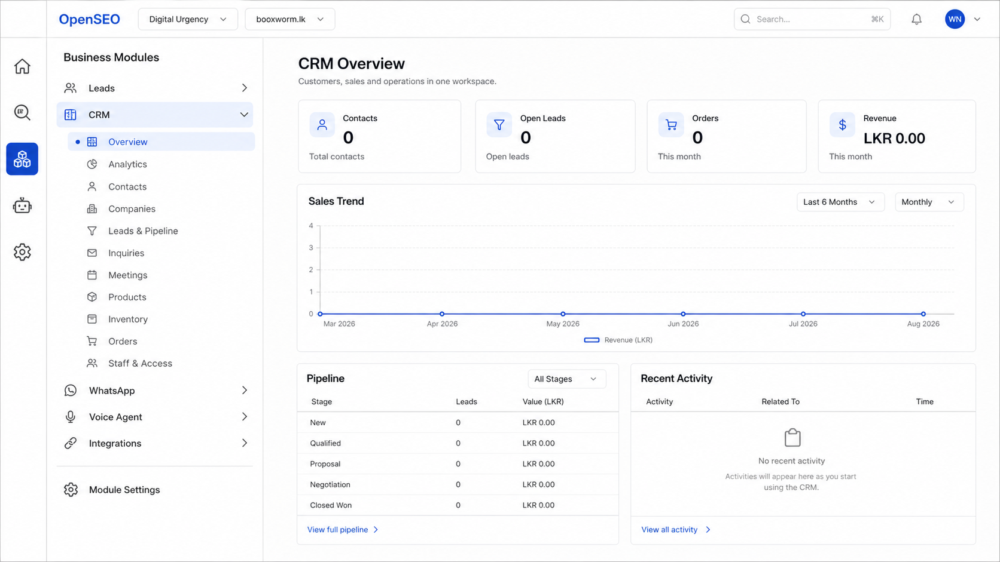

# Business module navigation design

This concept is the navigation target for OpenSEO's business modules. It uses a
persistent three-zone desktop layout so users can move through business tools
without losing their place in OpenSEO.

## Layout

1. **Product rail:** a narrow, persistent icon rail for Home, SEO, Business
   Business, AI & MCP, and Settings. Selecting Business reveals the
   business navigator beside it.
2. **Business navigator:** the persistent expandable menu for CRM, WhatsApp,
   Voice Agent, and Integrations. Selecting a capability expands that
   module's own navigation in this panel.
3. **Workspace:** the large panel on the right. Selecting a submenu item changes
   this workspace only; it does not replace either navigation zone or send the
   user back through a module-card launcher.

## CRM expanded state

The concept shows CRM expanded with:

- Overview
- Leads
- Analytics
- Contacts
- Companies
- Pipeline / Opportunities
- Inquiries
- Meetings
- Products
- Inventory
- Orders
- Staff & Access

Products, Inventory, and Orders communicate the intended commerce destination;
they remain subject to the migration sequence recorded in
`BUSINESS_MODULE_MIGRATION_SCOPE.md` and must not be represented as implemented
before their schema and workflows exist.

## Interaction rules

- The four primary business capabilities are navigation items, not a grid of
  cards. Leads appears within CRM while retaining its independent entitlement.
- The active primary module and active submenu item must both remain visible.
- Switching submenu items changes only the right-hand workspace.
- Switching primary modules replaces the submenu in the business navigator and
  opens that module's last-used or default workspace.
- Module entitlements determine which primary modules appear. Staff permissions
  determine which submenu actions are available.
- Responsive behavior may collapse the navigator into a drawer, but desktop
  behavior must preserve the three-zone hierarchy shown above.

The visual treatment is intentionally restrained: white and light-gray surfaces,
thin borders, compact typography, simple line icons, and OpenSEO blue reserved
for active state and primary actions.
